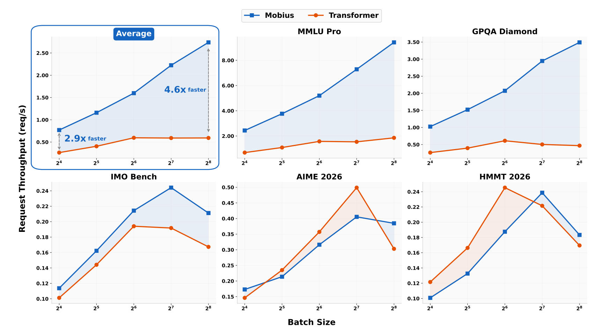
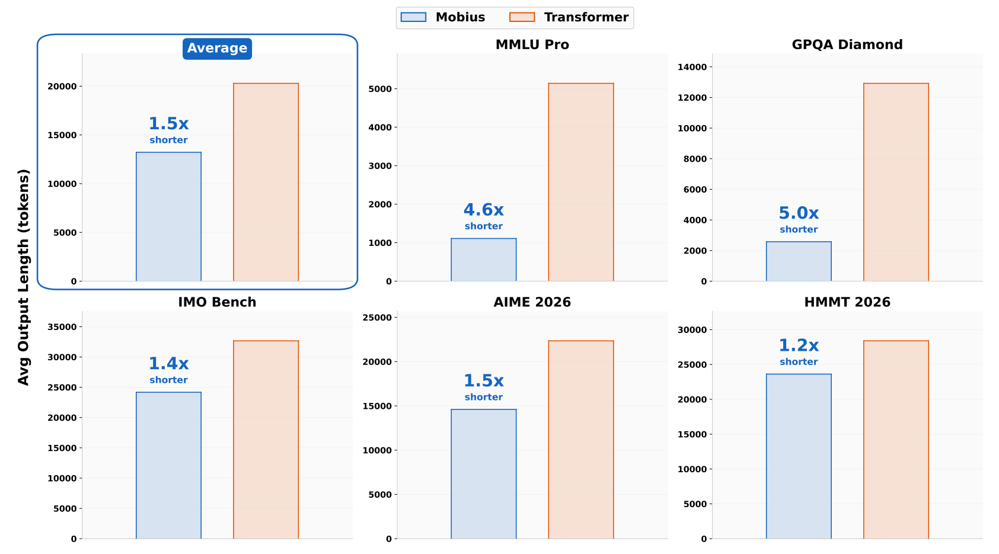
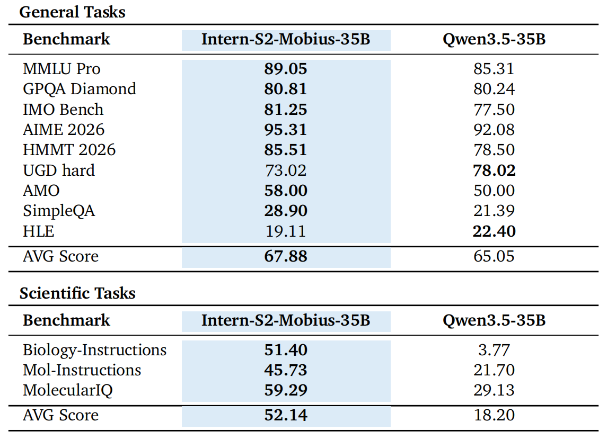
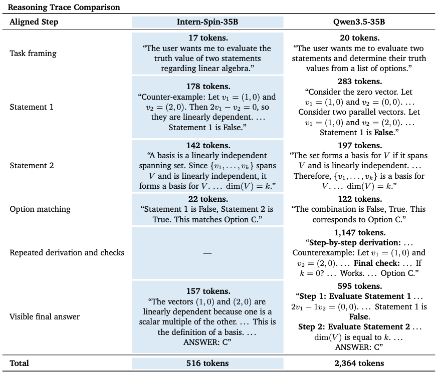

## Intern-S2-Mobius

<div align="center">
 

  <div>&nbsp;</div>

[💻Github Repo](https://github.com/InternLM/Intern-S2-Mobius) • [🤗Model Collections](https://huggingface.co/collections/internlm/intern-s2) • [🌳Arch Space](https://github.com/InternLM/archspace)

</div>

## Visualization


https://github.com/user-attachments/assets/b1970bdb-44ca-4e48-b213-fa693aa6f6fe


## Introduction

We introduce **Intern-S2-Mobius**, a 35B foundation model built on the Mobius-v0 architecture realized by Xtuner and LMDeploy. Instead of binding knowledge storage and reasoning computation layer by layer as in conventional Transformer models, Mobius organizes knowledge into a globally shared **Memory** and lets multiple **Reasoners** iteratively query and refine hidden states against this shared repository.

This knowledge-reasoning separation gives Intern-S2-Mobius two native capabilities: **Backward Residual Connection**, where reasoning stages can access knowledge beyond their local layer hierarchy, and **Dynamic Latent Reasoning**, where deliberation, refinement, and multi-token prediction are internalized into high-density continuous states. Continual-pretrained from Qwen3.5-35B and further post-trained with SFT and RL, Intern-S2-Mobius preserves strong downstream capability while achieving substantially higher end-to-end inference efficiency, with nearly 4x speedup reported in the technical report.

### Features

- **Knowledge-reasoning decoupled architecture.** Intern-S2-Mobius separates knowledge vectors from reasoning operators by replacing layer-bound FFN knowledge storage with a globally shared Memory. This gives each Reasoner access to a broader knowledge space and improves knowledge compression compared with a standard Transformer layout.

- **Backward Residual Connection.** Through shared Memory, shallow and deep reasoning stages can access knowledge across the model rather than relying only on forward layer-wise information flow. This enables more flexible cross-layer knowledge composition and helps the model synthesize useful information in fewer reasoning steps.

- **Dynamic Latent Reasoning.** Mobius refines continuous hidden states through recurrent latent iteration before decoding. This internalizes part of the deliberation process, reduces reliance on long visible chain-of-thought, and dynamically allocates computation to different tokens.

- **Higher inference efficiency with concise reasoning.** On reasoning benchmarks, Intern-S2-Mobius reaches comparable or stronger scores than the Qwen3.5-35B baseline while producing markedly shorter reasoning traces and higher request throughput, leading to nearly 4x end-to-end inference speedup in the reported evaluation.

- **Strong general and scientific performance.** Intern-S2-Mobius improves the reported average score over Qwen3.5-35B on general reasoning benchmarks, and shows large gains on scientific tasks such as Biology-Instructions, Mol-Instructions, and MolecularIQ.

<figure>
  
  <figcaption>Fig1: Inference efficiency on reasoning benchmarks. Intern-S2-Mobius improves request throughput over the Transformer baseline while maintaining strong reasoning performance, with gains largely coming from shorter, more compact reasoning traces.</figcaption>
</figure>

<figure>
  
  <figcaption>Fig2: The average output length of Mobius continual pre-trained from Qwen3.5.</figcaption>
</figure>

### Performance

We evaluate the Intern-S2-Mobius on various benchmarks, including general datasets and scientific datasets. We report the performance comparison with Qwen3.5-35B below. We use the [OpenCompass](https://github.com/open-compass/OpenCompass/) to evaluate all models. For text benchmarks, Intern-S2-Mobius is evaluated with a maximum inference length of 64K tokens on MMLU Pro, SimpleQA, and HLE, and 128K tokens on the remaining text benchmarks. 

<figure>
  
  <figcaption>Fig3: Performance comparison across general and scientific benchmarks. The higher score in each row is highlighted in <strong>bold</strong>.</figcaption>
</figure>

<figure>
  
  <figcaption>Fig4: Step-aligned comparison between Intern-S2-Mobius-35B and Qwen3.5-35B
    on a linear-algebra multiple-choice question. Both models select the correct
    answer (Option C). Token counts are computed using the Qwen3.5-35B tokenizer. Mobius completes the same reasoning steps with fewer tokens, which mainly benefits from the model's elimination of repeated derivation and checks.</figcaption>
</figure>


## Quick Start

The Intern-S2-Mobius release is a 35B model stored in bfloat16 weight format. This guide provides deployment examples for the following configurations:

- MTP speculative decoding (Recommended)
- Basic serving without MTP

> NOTE: The commands below are reference configurations. Inference frameworks are under active development, so use the latest framework documentation and your local validation results when tuning production deployments.

Intern-S2-Mobius can be deployed using any of the following LLM inference frameworks:

- LMDeploy
- Transformer
- vLLM

### Sampling Parameters

We recommend using the following hyperparameters to ensure better results

```python
top_p = 1
top_k = 50
min_p = 0.0
temperature = 0.8
```

### LMDeploy

Use the latest LMDeploy with Intern-S2-Mobius support. The examples below use single-GPU serving.

- Serving With MTP (Recommended)

```bash
lmdeploy serve api_server \
    internlm/Intern-S2-Mobius \
    --trust-remote-code \
    --backend pytorch \
    --tp 1 \
    --speculative-algorithm qwen3_5_mtp \
    --speculative-num-draft-tokens 4 \
    --dtype bfloat16 \
    --max-batch-size 64 
```

- Basic Serving Without MTP

```bash
lmdeploy serve api_server \
    internlm/Intern-S2-Mobius \
    --trust-remote-code \
    --backend pytorch \
    --dtype bfloat16 \
    --tp 1 
```


### Transformers

Use a recent Transformers version with remote-code loading enabled.

- Basic Inference

```python
import torch
from transformers import AutoModelForImageTextToText, AutoTokenizer

model_path = "internlm/Intern-S2-Mobius"

tokenizer = AutoTokenizer.from_pretrained(model_path, trust_remote_code=True)
model = AutoModelForImageTextToText.from_pretrained(
    model_path,
    trust_remote_code=True,
    torch_dtype=torch.bfloat16,
    device_map="auto",
).eval()

messages = [
    {"role": "user", "content": "Give me a short introduction to Intern-S2-Mobius."}
]

text = tokenizer.apply_chat_template(
    messages,
    tokenize=False,
    add_generation_prompt=True,
)
inputs = tokenizer(text, return_tensors="pt").to(model.device)

with torch.no_grad():
    output_ids = model.generate(
        **inputs,
        max_new_tokens=512,
        do_sample=True,
        temperature=0.8,
        top_p=1,
    )

response_ids = output_ids[0][inputs["input_ids"].shape[-1]:]
print(tokenizer.decode(response_ids, skip_special_tokens=True))
```

### vLLM

Use the latest vLLM Docker image or source build with Intern-S2-Mobius support.

- Serving With MTP (Recommended)

```bash
vllm serve \
    internlm/Intern-S2-Mobius \
    --trust-remote-code \
    --tensor-parallel-size 2 \
    --reasoning-parser qwen3 \
    --enable-auto-tool-choice \
    --tool-call-parser qwen3_coder \
    --spec-method mtp \
    --spec-tokens 4
```

- Basic Serving Without MTP

```bash
vllm serve \
    internlm/Intern-S2-Mobius \
    --trust-remote-code \
    --tensor-parallel-size 2 \
    --reasoning-parser qwen3 \
    --enable-auto-tool-choice \
    --tool-call-parser qwen3_coder 
```


